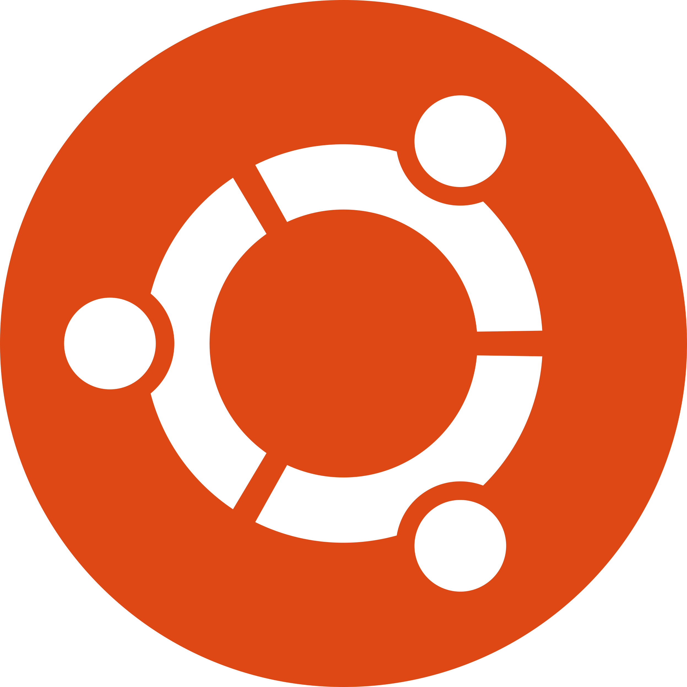

## Hi there , I'm Allan.

 
Fun, jovial and addicted programmer 😄. I'm a final year Biomedical Engineering Student from Nairobi, Kenya with great interests in C/C++, Qt, Linux, and Embedded Linux. I build both user interfaces (UI) for desktops, mobile and embedded systems, and back-end services. I love Linux, so, I also build custom Linux Operating systems using Buildroot/Yocto Projects for specialized projects.

 
 

I'm also the CInO at <a href="https://www.afecs.co.ke" target="_blank">THE AFECS Limited</a> where we build and engineer some amazing stuff. Technology is in our DNA!

 
 
 

## My Stats 😄

## My Top Git Languages 😄

## Some bits & bytes
- 🔭 I’m currently working on PCB Designs for Embedded Systems
- 🌱 I’m currently learning React Native
- 👯 I’m looking to collaborate on Embedded Systems Projects
- 💬 Ask me about C/C++, Qt, and Embedded Linux
- 📫 How to reach me: <a href="https://twitter.com/lalan_KE" target="_blank">Twitter</a> | <a href="https://www.linkedin.com/in/koech2205/" target="_blank">LinkedIn</a>
- 😄 Pronouns: He/Him
- ⚡ Fun fact: My music playlist rocks!

## My Software stack

| - | Logo | Name | Description |
| - |------|------|-------------|
| 1. |  | Ubuntu 20.04 | OS for daily use and programming |
| 2. |  | C++11 and C++17 | Software development language |
| 3. |  | Qt 5.15, Qt Quick & Qt Creator | Desktop, mobile & embedded UI design and programming |
| 4. |  | Git | Source Code Version Control |
| 5. |  | PostgreSQL 11+ | Database for structured data |
| 6. |  | Arduino & Arduino IDE | Hardware tinkering board |
| 7. |  | KiCAD | PCB & Circuit design |
| 8. |  | Inkscape | Vector Graphic Designing |
| 9. |  | VS-Code | Code Editor for JS, Py, Bash |
| 10. |  | Python 3.7+ | Desktop & Web Scripting |
| 11. |  | React Native | Mobile App Development |
| 12. |  | Javascript | Web & Mobile Scripting |
| 13. |  | Bash | Linux scripting |

